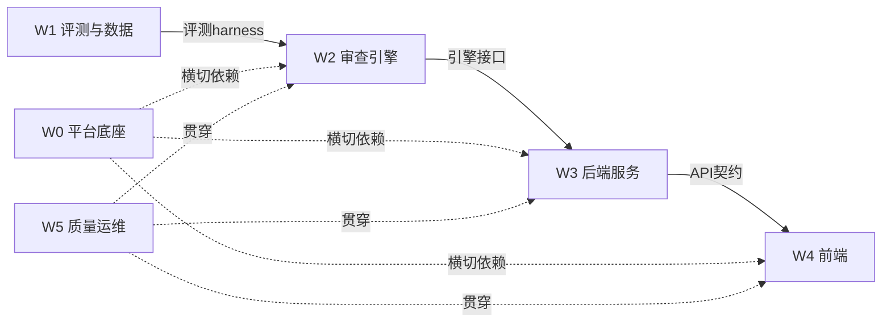

# 智能审查实施计划（可并行 Workstream）

> 日期：2026-08-15
> 前置：PRD v2.0（`docs/product/2026-08-15-intelligent-review-prd.md`）、链路审计（R-01~R-07 / E-01~E-10）
> 目标：把 PRD v2.0 拆成 6 个可并行 Workstream（W0–W5），明确依赖、关键路径、退出标准与协调点。
> 约定：每任务用 checkbox 跟踪；任务 ↔ 审计编号 ↔ 需求编号 三向对应。

---

## 一、Workstream 总览与并行矩阵

```text
        W0 平台底座（横切，先行）──────────────────────────────┐
        W1 评测与数据（独立，可最先启动）                       │
        W2 审查引擎（依赖 W1 的评测 harness）                   │
        W3 后端服务（依赖 W2 引擎接口；可先用 fake 引擎启动）     │
        W4 前端（依赖 W3 API 契约；可先用 mock 启动）            │
        W5 质量运维（横切，贯穿）───────────────────────────────┘
```

| WS | 名称 | 可并行度 | 关键依赖 | 对应审计编号 |
| --- | --- | --- | --- | --- |
| W0 | 平台底座 | 最高优先级横切 | 无（先行） | E-01/02/04/05/06/07 |
| W1 | 评测与数据 | 完全独立 | 无（可最先启动） | R-01/02/04/07 + E-08 |
| W2 | 审查引擎 | 高（确定性部分独立） | W1 评测 harness（LLM 部分） | R-03/05/06 |
| W3 | 后端服务 | 中（契约先行） | W2 引擎接口（可 fake） | E-03 + FR-04/06/08/09 |
| W4 | 前端 | 中（UI 骨架先行） | W3 API 契约（可 mock） | FR-01/02/03/05/07 + E-05/09 前端侧 |
| W5 | 质量运维 | 横切 | 贯穿各阶段 | E-09/10 + R-04 回归门 + M-01~15 |

**关键路径**：W0（安全/错误/日志）→ W2（引擎）→ W3（服务）→ W4（前端）→ W5（验证）。
**可并行**：W1 全程独立；W2 确定性匹配器、W4 UI 骨架、W5 CI 脚手架均可提前启动，不等关键路径。

---

## 二、依赖图



实线=数据/接口依赖；虚线=横切（安全/日志/质量门约束所有服务）。

---

## 三、模块边界与依赖约束

> 所有 W0–W5 任务必须锚定到以下模块文件；新增文件必须遵守依赖方向，禁止越界 import。

### 3.1 硬约束

1. **单向依赖**：`api → services → core`，禁止反向或跨层 import（README 铁律）。
2. **审查域隔离**：审查逻辑只进 `services/review/`，不散落到 `document_*`/`qa_service`；复用现有 `document_pipeline`（解析）、`search`（检索）、`utils` 通过 import，**不复制**。
3. **不引入 LangChain 运行时依赖**（档位 A 已决议）；档位 B 若做，独立模块 + 可选导入，不污染主链路。
4. **评测独立**：`eval/` 非运行时服务，只被 `scripts/` 与 CI 调用，不进入 `api → services → core` 链。
5. **命名对齐**：下划线模块（`document_pipeline` 风格）；路由文件 `review.py`（同 `chat.py`/`docs.py`）。

### 3.2 模块树

```text
backend/
├── api/
│   ├── middleware/              # W0：认证/错误/日志中间件
│   │   ├── auth.py              #   E-01
│   │   ├── errors.py            #   E-06
│   │   └── logging.py           #   E-07
│   ├── routes/review.py         # 审查路由（规则/批次/任务/处置/报告）
│   └── schemas.py               # 追加 review 模型（过大拆 schemas/review.py 再聚合）
├── core/
│   ├── config.py                # 追加 review 配置（pagination/llm/评测路径）
│   ├── http_client.py           # W0-2 统一 TLS 客户端工厂
│   ├── audit.py                 # W0-3 审计写入器
│   ├── log_redactor.py          # W0-4 日志脱敏
│   └── metrics.py               # W0-7 指标
├── services/
│   ├── review/                  # ★ 审查域独立子包
│   │   ├── store.py             #   存储（JSON+原子写+漂移扫描）
│   │   ├── engine.py            #   引擎编排 + 版本六元组快照
│   │   ├── matchers.py          #   keyword/regex/scope/numeric 匹配器
│   │   ├── anti_fp.py           #   反误报过滤层
│   │   ├── prompt.py            #   反误报规则 + few-shot 提示词构造
│   │   ├── evidence.py          #   证据定位（bbox 3 级回退）
│   │   ├── job_runner.py        #   任务状态机 + 队列 + 重试/死信 + SSE 产出
│   │   ├── hitl.py              #   处置 HITL（档位 A）
│   │   ├── report.py            #   报告生成（Markdown）
│   │   └── assistant.py         #   问答助手（复用 search）
│   └── review_service.py        # 聚合入口（路由只依赖它，不写业务逻辑）
├── eval/                        # ★ 评测独立（非运行时服务）
│   ├── issue_associator.py      #   检测↔金标相似度关联
│   ├── metric_calculator.py     #   分层混淆矩阵/精确率/召回率/F1
│   ├── calibration.py           #   置信度校准表
│   ├── regression.py            #   回归门（降幅>2pp 阻断）
│   ├── coverage.py              #   覆盖率/拒答指标
│   └── gold/                    #   金标数据（SHA-256 锁定）
├── scripts/
│   ├── eval_review.py           # 评测/回归入口
│   └── backup_review.py         # 备份/恢复
└── tests/
    ├── test_review_matchers.py  # 确定性匹配器（无 LLM）
    ├── test_review_engine.py    # fake LLM 集成
    └── test_review_api.py       # 契约测试

frontend/src/
├── api/review.ts                # 一域一文件，对齐 api/docs.ts
├── stores/review.ts             # 已有，改造 async actions
├── types/index.ts               # 补企业级字段（六元组/置信度/审计）
├── components/
│   ├── SafeMarkdown.vue         # W0-5 安全渲染组件
│   └── review/                  # 已有复用（RiskCard 等）
└── views/review/                # 已有，接真实 API
```

### 3.3 依赖规则

| 模块 | 允许依赖 |
| --- | --- |
| `services/review/*` | `core.config` + `services.utils` + 显式允许的 `services.search`/`services.document_pipeline` |
| `services/review_service.py` | 只编排 `services/review/*`，不写业务逻辑 |
| `api/routes/review.py` | `services.review_service` + `api.schemas` |
| `eval/*` | 可依赖 `services/review`（读引擎产出），但**不被任何运行时 import** |

### 3.4 任务 → 模块锚点

| 任务 | 锚定文件 |
| --- | --- |
| W0-1 认证边界 | `backend/api/middleware/auth.py`（新） |
| W0-2 TLS 客户端 | `backend/core/http_client.py`（新）；改造 `document_pipeline.py`/`search.py`/`qa_service.py`/`parallel_qa.py`/`indexer.py`/`main.py` |
| W0-3 审计 | `backend/core/audit.py`（新） |
| W0-4 密钥治理 | `backend/core/log_redactor.py`（新）+ `core/config.py` + `.env.example` |
| W0-5 安全渲染 | `frontend/src/components/SafeMarkdown.vue`（新） |
| W0-6 错误协议 | `backend/api/middleware/errors.py`（新）+ `main.py` |
| W0-7 可观测 | `backend/api/middleware/logging.py`（新）+ `core/metrics.py`（新） |
| W1-1 金标 | `backend/eval/gold/*.json`（数据） |
| W1-2 分层评测 | `backend/eval/issue_associator.py` + `metric_calculator.py` |
| W1-3 置信度校准 | `backend/eval/calibration.py` |
| W1-4 回归门 | `backend/eval/regression.py` + `scripts/eval_review.py` |
| W1-5 覆盖率/拒答 | `backend/eval/coverage.py` |
| W1-6 数据治理 | `scripts/backup_review.py` + `backend/migrations/` |
| W2-1 确定性匹配器 | `services/review/matchers.py` |
| W2-2 反误报 | `services/review/anti_fp.py` |
| W2-3 LLM 检查项 | `services/review/prompt.py` + `engine.py` |
| W2-4 证据定位 | `services/review/evidence.py` |
| W2-5 可复现快照 | `services/review/engine.py`（六元组） |
| W2-6 降级链 | `services/review/job_runner.py` |
| W2-7 错误处理 | `services/review/job_runner.py`（幂等/重试/死信） |
| W3-1 存储 | `services/review/store.py` |
| W3-2 Schemas | `api/schemas.py`（过大拆 `api/schemas/review.py`） |
| W3-3 契约测试 | `tests/test_review_api.py` |
| W3-4 状态机队列 | `services/review/job_runner.py` |
| W3-5 SSE 流式 | `api/routes/review.py` + `job_runner.py` |
| W3-6 处置 HITL | `services/review/hitl.py` |
| W3-7 报告导出 | `services/review/report.py` |
| W3-8 重审/失败块重试 | `job_runner.py` + `api/routes/review.py` |
| W3-9 问答助手 | `services/review/assistant.py`（复用 `services/search`） |
| W4-1 API/store | `frontend/src/api/review.ts` + `stores/review.ts` |
| W4-2 四步页接 API | `frontend/src/views/review/*.vue` |
| W4-3 控制台 | `views/review/ReviewConsoleView.vue` + `components/review/RiskCard.vue` |
| W4-4 处置交互 | `components/review/`（新增决策对话框组件） |
| W4-5 问答助手 Tab | `components/review/ReviewAssistant.vue` |
| W4-6 可访问性 | `frontend/src/styles/main.css` + 各 review view |
| W4-7 安全渲染接入 | 接入 `components/SafeMarkdown.vue`（W0-5） |
| W5-1 CI | `.github/workflows/ci.yml` |
| W5-2 测试分层 | `backend/tests/*` + `frontend/src/**/*.spec.ts` |
| W5-3 质量门 | `frontend/package.json`（覆盖率/bundle/typecheck/lint） |
| W5-4 回归门 CI | `.github/workflows/eval.yml` + `scripts/eval_review.py` |
| W5-5 可观测落地 | `core/metrics.py` 消费侧 |
| W5-6 容量治理 | `services/review/job_runner.py`（队列/背压/并发配置） |
| W5-7 验收证据 | `docs/`（报告/截图归档） |

---

## 四、W0 平台底座（横切 P0，先行）

> 退出标准：E-01/02/04/05/06/07 全部验收；后续所有 workstream 在其上构建。

- [ ] **W0-1 认证与部署边界**（E-01）：单机强制 loopback 绑定 + 启动检测拒绝非 loopback + 反向代理暴露拒绝；可选本地 token。
- [ ] **W0-2 TLS fail-closed**（E-02）：统一 HTTP 客户端工厂（ES/Embedding/LLM/MinerU），默认 `verify=True` + 受信 CA 配置；删除 8 处 `verify=False`/`ssl_show_warn=False`/`disable_warnings`。
- [ ] **W0-3 审计基础**（E-03 前置）：审计事件 schema + 追加式写入器（单调序号 + 前条 hash）+ 只读导出。
- [ ] **W0-4 密钥治理**（E-04）：日志脱敏过滤器 + 启动密钥校验 + `.env.example` 更新。
- [ ] **W0-5 安全渲染组件**（E-05）：唯一 Markdown/HTML 消毒组件（allowlist）+ 单测（XSS 用例）。
- [ ] **W0-6 错误协议**（E-06）：稳定错误码 + `retryable` + `support_id` 中间件；改造 `/api/health/index` 不泄堆栈。
- [ ] **W0-7 可观测底座**（E-07）：结构化日志 + `request_id` 贯穿中间件 + 依赖健康只读页（脱敏）。

---

## 五、W1 评测与数据（完全独立，可最先启动）

> 退出标准：分层评测工具、校准表、回归集就绪；E-08 数据治理脚本就绪。

- [ ] **W1-1 金标集构建**：≥30 份解除协议标注（单人标注 + 独立复核），金标 JSON 格式固定 + SHA-256 锁定。
- [ ] **W1-2 分层评测工具**（R-01）：移植参考项目 `issue_associator.py` + `metric_calculator.py` → `backend/eval/`；扩展 per-rule×severity×doc_type 的混淆矩阵与 FP/FN 清单。
- [ ] **W1-3 置信度校准**（R-02）：校准脚本按 confidence 档位算实际精确率 → 校准表（随版本发布）。
- [ ] **W1-4 回归集与回归门**（R-04）：固定回归集 ≥10 份 + 自动回归脚本（降幅 >2pp 阻断）。
- [ ] **W1-5 覆盖率/拒答指标**（R-07）：覆盖率计算 + 拒答金标集 + 拒答正确率脚本。
- [ ] **W1-6 数据治理**（E-08）：`.review_data/` 备份/恢复脚本 + schema 迁移版本 + 数据出境说明文档。

---

## 六、W2 审查引擎（算法核心）

> 退出标准：R-03/05/06 引擎侧验收；确定性匹配器单测全绿；LLM 检查项通过 W1 harness 评测。

- [ ] **W2-1 规则 DSL 与确定性匹配器**（独立，可提前）：keyword/regex/scope/numeric 匹配器 + 单测（纯确定性，无 LLM）。
- [ ] **W2-2 反误报过滤层**：序号/占位符/勾选框/合同标准文本等确定性过滤 + 单测。
- [x] **W2-3 LLM 检查项**（依赖 W1 harness）：prompt 构造（系统提示 + 指导 + few-shot）+ Pydantic 结构化输出 + 解析失败重试 1 次。
- [x] **W2-4 证据定位**（R-03 证据侧）：移植 `bbox.py` + PDF 3 级回退（文本层→MinerU layout span→段落 bbox）+ DOCX 锚点。
- [x] **W2-5 可复现快照**（R-03）：版本六元组 + LLM 显式 seed + 记录 provider model/usage/finish_reason。
- [x] **W2-6 降级链**（R-05）：LLM 不可用 → 仅确定性 + `complete_degraded`；单文件失败隔离；检索失败拒答。
- [x] **W2-7 错误处理**（R-06）：块级幂等（chunk_id+rule_id）+ 指数退避重试 ≤2 + 死信清单。

---

## 七、W3 后端服务（契约先行）

> 退出标准：FR-04/06/08/09 验收；终态唯一/恢复/审计测试通过。

- [x] **W3-1 存储层**（`backend/services/review/store.py`）：批次/文件/范本/规则/任务/风险/审计，JSON+原子写+启动漂移扫描。
- [x] **W3-2 Schemas**：review 请求/响应模型（对齐 v2 §2）。
- [x] **W3-3 API 契约测试先行**：规则 CRUD/批次/任务/处置/报告 端点契约测试（RED 先写）。
- [x] **W3-4 任务状态机与队列**（E-10 前置）：最小持久队列 + 背压 + 并发上限 + 超时 + 幂等键。
- [x] **W3-5 SSE 流式**：`/jobs/{id}/stream`（issues/complete/error）+ 空数组语义。
- [x] **W3-6 处置 HITL（档位 A）**：`decisions/start|resume` 轻量状态机 + 审计写 W0-3。
- [x] **W3-7 报告导出**：定稿二次确认 + Markdown 报告快照（绑定版本六元组）。
- [x] **W3-8 重审/失败块重试**：`/jobs/{id}/rerun` + `retry_failed_chunks`。
- [x] **W3-9 问答助手**：job 范围检索 + SSE 唯一终态（复用现有 search.py，走 W0 TLS 客户端）。

---

## 八、W4 前端（UI 骨架先行）

> 退出标准：FR-01/02/03/05/07 验收；三视口 + 键盘 + 对比度达标；演示数据退役。

- [ ] **W4-1 API 模块**（`frontend/src/api/review.ts`）+ store async actions（可先 mock 并行）。
- [ ] **W4-2 四步页接入真实 API**：上传/范本/规则/控制台替换演示数据（加载/失败/空态/部分失败四态）。
- [ ] **W4-3 控制台**：三栏布局 + 风险流式增量 + 筛选 + PDF quadpoints/DOCX 锚点高亮。
- [ ] **W4-4 处置交互**：采纳/驳回对话框 + 置信度"历史准确率"角标 + HITL 两步确认。
- [ ] **W4-5 问答助手 Tab**：流式 + 引用定位 + 拒答展示。
- [ ] **W4-6 可访问性**：三视口无横向滚动 + 键盘 + 44px + aria + AA 对比度 + prefers-reduced-motion。
- [ ] **W4-7 安全渲染接入**：所有 LLM 输出/报告/风险解释走 W0-5 组件。

---

## 九、W5 质量与运维（横切贯穿）

> 退出标准：E-09/10 + R-04 回归门 + M-01~M-15 达标；交付证据归档。

- [ ] **W5-1 CI 脚手架**：GitHub Actions/本地 CI（后端 pytest + 前端 Vitest + typecheck + lint）。
- [x] **W5-2 测试分层**：后端单测 + fake 依赖集成 + API 契约 + 前端组件/视图测试 + E2E（固定夹具）。
- [ ] **W5-3 质量门**：覆盖率门 + bundle budget + 安全扫描（密钥/依赖/XSS）。
- [x] **W5-4 回归评测门接入 CI**（R-04）：变更触发回归集，降幅 >2pp 阻断合并。
- [x] **W5-5 可观测落地**：耗时/token/成本/错误率指标 + 任务追踪（配合 W0-7）。
- [x] **W5-6 容量治理**：背压/死信/并发/分页/速率限制验收（E-10）。
- [x] **W5-7 验收证据**：M-01~M-15 实测报告 + 三视口截图 + 决策门证据归档。

---

## 十、并行调度建议（示例时间线，3 人小队）

```text
周1  周2  周3  周4  周5  周6
W0 ████████████████ (横切，最早完成并支撑其余)
W1 ████████████ (独立，最先启动，第3周交付harness)
W2     ██████████████ (第2周起，确定性先行，第3周接入harness)
W3         ████████████ (第3周起，契约先行+fake引擎)
W4             ████████████ (第4周起，UI骨架先行+mock)
W5 ░░贯穿░░░███████████ (CI脚手架第1周，验收第6周)
```

- 人力映射：算法工程师 → W1+W2；后端工程师 → W0+W3；前端工程师 → W4+W5 前端侧；DevOps → W0+W5。
- 单人模式下：按关键路径串行 W0→W2→W3→W4，W1 穿插（标注可外包），工期约 6–8 周。

---

## 十一、协调点与风险

| 协调点 | 内容 | 责任 |
| --- | --- | --- |
| 契约冻结 | W2 引擎接口 + W3 API schema + W4 前端类型在 W3 启动前冻结一版 | W3 牵头 |
| 审计 schema | W0-3 审计事件字段被 W3-6 使用，第 1 周冻结 | W0 |
| 评测集 hash | W1 锁定后同步给 W2-5 版本六元组 | W1 |
| TLS 回归 | W0-2 改动全链路，需 W5-2 全链路回归兜底 | W0+W5 |
| 演示数据退役 | W4-2 与 W3 完成联调后一次性移除，防"真假 AI"并存 | W4 |

**主要风险**：TLS 修复回归面广（已设 W5-2 兜底）；企业级底座挤占审查交付（W0 先行 + 流式跟进缓解）；标注人力（W1 外包/同事复核缓解）。
