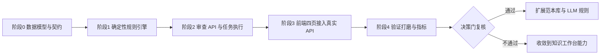

# 智能审查四步流程整体方案设计

> 日期：2026-08-15
> 状态：方案设计（待决策门确认后进入实施）
> 适用范围：Vue3 前端、FastAPI 业务 API、MinerU 解析链路、Elasticsearch 检索链路
> 前置依据：`docs/product/2026-07-19-page-function-iteration-target.md`（迭代基线与决策门）、`docs/superpowers/specs/2026-07-19-review-prototype-integration-design.md`（现有四步演示原型）
> **需求细化**：`2026-08-15-intelligent-review-requirements-refinement.md`（v2，参考 LangChain v1.1 通用 AI 文档审核实战项目，细化数据契约/引擎/HITL/评测，并将首个纵切类型更新为劳动合同解除协议）
>
> **v2 覆盖对照（冲突时以 v2 为准）**：
> - §2.1/§6.2 风险状态机 `open/approved/rejected/ignored` → v2 收敛为 `not_reviewed/accepted/dismissed`
> - §5.2 规则 DSL（含 llm_check 子字段）→ v2 §2.2/§3.1 双通道（matcher + llm_fallback）
> - §5.2 "UNKNOWN 降为 low" → v2 不自动降级，标注"待人工确认"（灵敏度参数可配）
> - §7 审计 `audit.jsonl` → v2 明确为事实源，`issue.audit[]` 为派生视图
> - §6.3/§11 首个纵切 MSA → v2 §6 劳动合同解除/终止协议书
> - §6.1 重审语义 → v2 改为 `POST /jobs/{id}/rerun`（避免副作用 GET）
> - 任务快照补充 llm_model/temperature、任务级定稿见 v2 §3.3/§8
> 结论先行：把现有"前端本地演示"的四步审查（文档上传 → 范本选择 → 条款设置 → 智能审查）升级为**真实可验收的审查闭环**。分四个阶段实施，第一阶段只做"一个合同类型 + 一个版本化范本 + 10–20 条确定性规则"的纵切，明确不一次性复制原型的所有承诺。

---

## 1. 方案定位与目标

### 1.1 为什么现在做

当前 `frontend/review/*` 四页是**纯前端演示**：使用 store 中的本地假数据，不调用任何后端接口（见原型整合设计第 33、46 行）。演示价值已完成，但：

- 风险卡片、审批、导出等交互"看起来可用"，实际没有任何数据契约支撑；
- 无法回答"这份合同有哪些真实风险、依据哪条规则、命中原文在哪"这类用户最关心的问题；
- 与知识库的文档解析、检索能力完全割裂，用户需要重复上传。

### 1.2 目标（北极星）

> 用户上传一批合同文档，选择一个版本化审查范本并调整规则与灵敏度，系统对每份文档产出**带规则版本、原文定位证据、可解释理由**的风险清单；用户逐条处置（通过/驳回/忽略）、对存疑风险向"当前文档 + 命中规则"范围追问，最后导出可审计的审查报告。

### 1.3 设计原则

1. **不伪造真实分析**：每个风险必须绑定 `rule_version + 命中原文 + locator + reason`；没有证据链的风险不出现在结果中。
2. **确定性优先，LLM 兜底**：规则匹配先走可测试的确定性匹配器（正则/关键词/条款定位/数值阈值），只有确定性匹配器无法判定的规则才调用 LLM，且 LLM 输出必须回落到同一证据契约。
3. **版本即事实源**：范本、规则、审查任务、风险实例全部带版本快照，结果可复现、可审计。
4. **复用而非另起炉灶**：文档解析复用现有 `document_pipeline`（MinerU → IR → preview.md），检索复用现有 ES 混合检索；只新增"审查域"自己的实体与 API。
5. **渐进披露**：审查作为独立工作区入口，不与知识库上传入口混淆；四步只保留真正有价值的状态（批次、范本、规则、风险），去掉"额度、云端导入、OCR 开关"等未落地承诺。

---

## 2. 总体业务流程

```
┌────────────┐   ┌────────────┐   ┌────────────┐   ┌─────────────────────┐
│ 1 文档上传  │──▶│ 2 范本选择  │──▶│ 3 条款设置  │──▶│ 4 智能审查（任务）   │
│  批次+队列  │   │  匹配度    │   │  规则启停   │   │ 风险清单→处置→报告   │
└────────────┘   └────────────┘   └────────────┘   └─────────────────────┘
      │                │                │                    │
      ▼                ▼                ▼                    ▼
  ReviewBatch     ReviewTemplate   ReviewRule(快照)      ReviewJob
  (文件→doc_id)   (版本化,启用态)   (组/阈值/灵敏度)      (状态机+风险实例)
```

- 步骤 1 结束后批次进入 `ready`，步骤 2/3 只做配置选择，**不产生后端写操作**（除会话级草稿）。
- 步骤 4 "开始审查"才创建 `ReviewJob`，任务异步执行，前端轮询进度；任务完成后展示风险清单。
- 任一步骤的配置（范本、规则启停、灵敏度）都以**快照**写入任务，避免结果随规则库变化而漂移。

### 2.1 三个状态机

```text
ReviewBatch:  created → parsing(逐文件) → ready ──→ failed
                              │                        ▲
                              └──(某文件失败可重试)─────┘

ReviewJob:    queued → parsing → running → complete | failed | cancelled
                              └── 支持取消，取消后保留已产生部分结果

ReviewRisk:   open → approved | rejected | ignored      （可加 comment 审计）
```

终态三选一（`complete | failed | cancelled`），与聊天 SSE 终态约束保持一致，禁止"失败后仍显示完成"。

---

## 3. 步骤一：文档上传（批次）

### 3.1 产品行为

- 用户创建一个"审查批次"（batch），可命名，上传 1–50 个 PDF/DOCX（复用 `ALLOWED_EXT` 与 50MB 上限）。
- 每个文件独立进度与状态：`queued → parsing → normalizing → chunking → ready | failed`；失败可单文件重试，不阻塞整批。
- 上传的文件进入审查域自己的存储目录（`.review_data/batches/{batch_id}/docs/`），**不写入知识库索引**，避免"两套上传入口、数据割裂"（产品文档 §13 非目标）。
- 解析复用 `document_pipeline` 的解析核心（MinerU → IR → preview.md → 文本块），产出审查需要的**块级原文**（block_id、section_path、page、text）。
- OCR：仅在解析失败且检测为扫描件（无文本层）时提示"该文件疑似扫描件"，引导用户提供文本版；不承诺自动 OCR 能力。

### 3.2 状态呈现（对应现有 UploadQueue 组件）

| 现有演示状态 | 真实映射 |
| --- | --- |
| `uploading` 进度百分比 | 后端 `progress`（0–100）或阶段标签 |
| `queued` | 批次内文件排队 |
| `ready` | 解析完成，`ir.json` + 文本块可用 |
| `failed` | 保留 `error` 与"重试"入口，批次汇总显示失败数 |

### 3.3 API 契约

```text
POST   /api/review/batches            multipart: name + files[]  → 202 {batch}
GET    /api/review/batches            ?status=&page=&page_size=  → {items,total}
GET    /api/review/batches/{id}       → {batch, files:[{doc_id,filename,status,progress,error}]}
POST   /api/review/batches/{id}/files multipart: file           → 202 {file}   （补传/重试）
DELETE /api/review/batches/{id}       → 204                       （级联清理本地文件）
```

批次内每个文件落库为 `ReviewBatchFile {file_id, doc_id, filename, ext, status, progress, stage_label, error, block_count, created_at}`。

---

## 4. 步骤二：范本选择

### 4.1 产品行为

- 范本库按 `contract_type`（首个纵切：**服务协议 MSA**，与现有审查原型一致；后续可加劳动合同、租赁等）分组展示，支持搜索。
- 每张范本卡片展示：名称、合同类型、版本号、规则数、启用状态、最近更新时间；选中后右侧洞察面板展示该范本覆盖的规则组摘要与**匹配度**。
- 匹配度 = 确定性评分（文件名关键词命中 + 文档标题相似 + 条款关键词覆盖统计），**不调用 LLM**，结果可解释（展示贡献项）。
- 内置范本带 `is_builtin=true`；自定义范本（决策门后二期）从"规则配置"页另存为新版本。

### 4.2 范本实体（版本化）

```jsonc
{
  "template_id": "msa-standard",
  "name": "主服务协议标准审查",
  "contract_type": "msa",
  "version": 3,                      // 不可变版本号
  "is_builtin": true,
  "enabled": true,
  "rule_ids": ["liability-cap", "payment-terms", "data-privacy", "ip-assignment"],
  "summary": {"rule_count": 18, "high_severity": 4, "groups": {"finance": 9, "compliance": 6, "operations": 3}},
  "owner": "legal-core",             // 规则所有人
  "published_at": "2026-08-01",
  "changelog": "v3: 新增数据跨境条款检查"
}
```

范本发布后不可原地修改；调整规则即生成新版本。前端选中的是 `template_id + version` 组合。

### 4.3 API 契约

```text
GET  /api/review/templates              ?contract_type=&q=        → {items,total}
GET  /api/review/templates/{id}         ?version=                 → {template, rules:[...]}
POST /api/review/templates              （自定义范本，二期）
```

---

## 5. 步骤三：条款设置（规则配置）

### 5.1 产品行为

- 按规则组展示规则卡片：`finance 财务与支付`、`compliance 合规与运营`、`operations 模型与标记`；每条规则显示标题、说明、严重度、启用开关、阈值（如 "阈值: 30 天"）。
- 用户可启停规则、调整灵敏度（0–100）与模型选择；**这些修改仅保存在本次会话草稿**，点"开始审查"时随任务快照提交。
- 页面底部配置预览实时汇总：启用规则数、高风险规则数、灵敏度、规则版本，与现有原型右侧预览一致。
- 对无启用规则或未选范本的边界给出明确阻断提示。

### 5.2 规则 DSL（确定性优先）

每条规则 = `ReviewRule`，核心是匹配器定义（YAML 存储）：

```yaml
rule_id: liability-cap
group: finance
severity: high                    # high|medium|low
title: 责任限额
description: 累计法律责任限额与合同价值对比
enabled: true

matcher:
  # 1) 文本模式：关键词/正则，命中即产生候选风险
  text_pattern:
    - pattern: "(?i)aggregate liability|累计责任|责任上限"
      kind: keyword             # keyword | regex | phrase
  # 2) 条款定位：锁定在哪个 section 范围内匹配（缩小误报）
  scope:
    section_match: "(?i)limitation of liability|责任限制"
    window_blocks: 3            # 命中标题后的相邻块范围
  # 3) 数值阈值：从命中文本提取数值与阈值比较
  numeric:
    field: "liability_amount"
    unit: "usd"
    compare: "gt"               # gt|lt|gte|lte|eq
    threshold_ref: "contract_value"   # 或绝对阈值 5000000
  # 4) LLM 兜底：仅当上述无法确定时启用
  llm_check:
    prompt: "判断该责任条款是否取消了对间接损害的限制，只回答 YES/NO/UNKNOWN"
    fallback: "skip"            # skip|flag_low
```

匹配流程（对每个文档、每条启用规则）：

```text
取规则 scope 定位候选块
   │
   ├─ text_pattern 命中？ ──否──▶ 无风险
   │        │是
   ├─ numeric 存在？ ──是──▶ 提取数值 vs 阈值 → 判定
   │        │否/未命中
   ├─ llm_check 启用？ ──否──▶ 按 text_pattern 结果产出
   │        │是
   └─ LLM 判定 → YES 产出风险 / NO 忽略 / UNKNOWN 降为 low 并标注"需人工确认"
```

产出风险前必须能定位到**至少一个原文块**；任何规则产出的风险都携带 `rule_version`（规则内容 hash）与 `locator`（复用产品文档 §8.3 引用契约）。

### 5.3 API 契约

```text
GET  /api/review/templates/{id}/rules      → 规则组列表（含启用状态与阈值）
POST /api/review/jobs                      创建任务，body 即规则/参数快照（见第 7 节）
```

步骤 3 本身不新增写接口——"配置"通过创建任务时提交快照完成，保持无状态。

---

## 6. 步骤四：智能审查（任务、风险处置、问答、报告）

### 6.1 任务执行（ReviewJob）

- `POST /api/review/jobs` 提交：`batch_id + template_id/version + 启用规则快照 + 灵敏度 + 模型`。
- 后端立即持久化任务并返回 `job_id`；异步 worker 执行：
  - `queued → parsing`（读取批次各文档文本块）→ `running`（逐文档、逐规则跑匹配器，更新 `progress`）
  - 全程可取消（复用 `chat.py` 的 cancel registry 模式），取消后保留已生成风险并置 `cancelled`。
  - 任一文档解析缺失或规则执行异常：单条失败记录到 `job.errors[]`，不伪装成功。
- 前端轮询 `GET /api/review/jobs/{id}`（间隔 1s，任务完成后停止轮询），控制台页面在 `running` 时展示阶段性"已检查文档 X/Y、已命中风险 Z"。

### 6.2 风险实例（ReviewRisk）

```jsonc
{
  "risk_id": "job_8f2a_liability-cap_3",
  "job_id": "job_8f2a",
  "doc_id": "batch_b3_doc_7",
  "filename": "MSA_Corp_Services_v2.pdf",
  "rule_id": "liability-cap",
  "rule_version": "sha256:9f1c…",
  "rule_title": "责任限额",
  "severity": "high",                    // 灵敏度可上调：high→critical 展示层
  "status": "open",                      // open|approved|rejected|ignored
  "section_path": ["3", "LIMITATION OF LIABILITY"],
  "block_id": "block-42",
  "page_start": 5, "page_end": 5,
  "quote": "Provider's total aggregate liability … limited to $5,000,000 USD.",
  "reason": "命中关键词 aggregate liability；提取金额 5,000,000 USD 超过阈值 1x 年度合同价值；未发现间接损害豁免。",
  "suggestion": "建议将责任上限调整为 1x 年度合同价值并明确排除间接损害。",
  "confidence": "rule_deterministic" | "llm_yes" | "llm_unknown",
  "owner": null,
  "comment": "",
  "created_at": "2026-08-15 10:00:00"
}
```

- 风险按严重度分组展示（现有 RiskCard 复用），点击风险在文档阅读区**高亮对应原文块**（`block_id` 深链，复用预览 DOM 锚点机制）。
- 审批动作：`通过 approved / 驳回 rejected / 忽略 ignored`，必填或可选 `comment`，写入审计事件。

### 6.3 审查问答助手（job 范围检索）

- 对选中风险追问时，检索范围 = `job 的 doc_ids`（ES filter）+ 当前风险上下文（rule 描述 + quote + reason），复用现有混合检索 + 流式回答。
- 新接口 `POST /api/review/jobs/{id}/ask`，SSE 事件与 `/api/chat/stream` 同构（`meta → status* → token* → done|error|cancelled`），保证终态唯一。
- 助手回答带结构化引用，引用可点击跳回对应文档块；不命中任何块时明确返回"未找到依据"而非编造。

### 6.4 报告导出

- `GET /api/review/jobs/{id}/report?format=md|html` 生成审查报告：
  - 任务元信息（批次、范本版本、规则版本、模型、时间）
  - 汇总统计（文档数、风险数、按严重度分布、处置状态分布）
  - 每条风险：规则 + 严重度 + 原文引用 + 理由 + 建议 + 处置结果 + 审计人/时间
- 报告是只读快照，导出后不受后续处置变化影响。

### 6.5 API 契约汇总

```text
POST   /api/review/jobs                     {batch_id, template_id, template_version,
                                             rules:[{rule_id, enabled, threshold}],
                                             sensitivity, model}        → 202 {job}
GET    /api/review/jobs                     ?status=                    → {items,total}
GET    /api/review/jobs/{id}                → {job, progress, errors[], summary}
POST   /api/review/jobs/{id}/cancel         → 202
GET    /api/review/jobs/{id}/risks          ?severity=&status=&doc_id= → {items,total}
PATCH  /api/review/risks/{risk_id}          {status, comment}          → {risk}
POST   /api/review/jobs/{id}/ask            {question, risk_id?}       → SSE
GET    /api/review/jobs/{id}/report         ?format=md|html            → 文件下载
```

---

## 7. 数据模型与存储

### 7.1 存储布局

沿用项目现有 JSON 文件持久化风格（同 `.chat_data/`），独立目录，原子写 + 启动一致性扫描：

```text
.review_data/
├── batches.json                  # 批次索引（含文件摘要，非事实源）
├── batches/{batch_id}/
│   ├── meta.json                 # 批次与文件状态（事实源）
│   └── docs/{doc_id}/            # 审查域文档（original.ext, ir.json, blocks.json）
├── templates.json                # 内置范本（含版本）
├── templates/{template_id}/rules.yaml
├── jobs.json                     # 任务索引
└── jobs/{job_id}/
    ├── job.json                  # 任务 + 配置快照 + 进度 + 错误
    ├── risks.json                # 风险实例列表
    ├── audit.jsonl               # 处置审计事件
    └── report.md                 # 导出报告缓存
```

设计说明：`batches.json / jobs.json` 仅作为列表索引，**事实源是每个批次/任务目录内的 meta/job 文件**——这正是产品文档 P0-2 强调的"列表与真实数据不漂移"。启动扫描发现索引与目录不一致时进入可见修复队列。

> 若后续 P0 升级 SQLite 作为全局事实源，本方案的数据实体（batch/file/template/rule/job/risk/audit）可直接映射为表结构，接口契约不变。

### 7.2 实体关系

```text
ReviewBatch 1 ── n ReviewBatchFile (doc_id, status, progress)
ReviewTemplate 1 ── n ReviewRule (versioned)
ReviewJob 1 ── 1 ReviewBatch
ReviewJob 1 ── 1 规则快照 (template_id+version, rules[], sensitivity, model)
ReviewJob 1 ── n ReviewRisk
ReviewJob 1 ── n AuditEvent
```

---

## 8. 前端集成方案

### 8.1 迁移路径（demo → 真实 API）

| 现有演示页 | 真实数据来源 | 保留的演示成分 |
| --- | --- | --- |
| `/review/upload` | `POST /api/review/batches` + 轮询 `GET /batches/{id}` | 拖拽区、文件队列 UI（去掉额度/云端导入卡片） |
| `/review/templates` | `GET /api/review/templates` + 匹配度接口 | 分类 tab、搜索、卡片、洞察面板 |
| `/review/rules` | `GET /templates/{id}/rules`；修改仅本地草稿 | 分组规则卡、灵敏度滑杆、配置预览 |
| `/review/console` | `POST /api/review/jobs` → 轮询 → `GET /jobs/{id}/risks` | 三栏布局、文档阅读区、风险卡、问答助手、审批、导出 |

### 8.2 review store 改造

- 保留现有同步 actions（步骤切换、本地草稿），新增 async actions：
  - `createBatch(files)`、`refreshBatch(id)`、`loadTemplates()`、`loadRules(templateId)`、
  - `startJob()`、`refreshJob(id)`（带轮询去重与停止条件）、`loadRisks(filters)`、
  - `updateRisk(id, status, comment)`、`askOnRisk(question, riskId)`（SSE 消费）、`exportReport()`。
- 新增 `frontend/src/api/review.ts` 模块（对齐现有 `api/docs.ts` 风格）。
- 状态字段扩展：`batchId, jobId, jobStatus, progress, jobErrors[], loadingFlags, apiError`。
- **演示数据退役**：本地 `DEMO_FILES/TEMPLATES/CLAUSES/RISKS` 仅保留在测试夹具中；页面在真实接口返回前显示骨架/空态，禁止回退到假数据。若需保留演示入口，仅放 `/demo/review/*` 并明确标注（产品文档 M0 要求）。

### 8.3 页面状态覆盖

每页补齐：加载中、接口失败（可重试）、空态（如"无范本/无启用规则/风险为空"）、部分失败（单文件失败不阻塞批次）、任务取消、报告生成中。风险卡片上的 `confidence` 标注（规则命中 / LLM 确认 / 待人工确认）用于诚实展示分析来源。

### 8.4 文档阅读区深链

控制台高亮选中风险时，用 `block_id` 定位 `batch/docs/{doc_id}` 渲染出的 DOM 锚点（复用现有 preview 大纲锚点实现），滚动到目标块并加高亮 class；移动端切换为纵向排列并保留 Tab 结构。

---

## 9. 安全、版本与审计

- **版本链**：规则内容 hash 即 `rule_version`；风险、报告均记录 `template_version + rule_version + model + 引擎版本`，任何结果可复现。
- **审计**：风险处置（approved/rejected/ignored）写入 `audit.jsonl`（risk_id、动作、comment、时间、操作者——当前单机模式操作者为 `local`，团队模式接入账号体系）。
- **权限**：单机模式仅 loopback；若进入团队模式，批次/任务/范本增加 owner 归属，未授权不可读/写/删（对齐产品文档 P0-1）。
- **不暴露内部实现**：错误信息使用稳定错误码 + 用户可读说明 + `support_id`，禁止 Python/ES 堆栈进入前端（对齐 P0-3）。
- **LLM 调用**：规则内嵌 prompt 由规则版本锁定；LLM 结果必须回落证据契约，`UNKNOWN` 不冒充结论。

---

## 10. 测试与验收标准

### 10.1 测试分层

| 层 | 内容 | 工具 |
| --- | --- | --- |
| 规则引擎单测 | 每个 matcher（keyword/regex/numeric/scope）纯确定性用例；无 LLM 依赖 | unittest / pytest |
| 引擎集成 | fake LLM（固定 YES/NO/UNKNOWN）驱动整条规则链；证据契约断言（quote/locator/rule_version 非空） | fake 依赖栈 |
| API 契约 | 每个 review 端点：happy path + 400/404 + 终态唯一（cancelled 不发送 done） | FastAPI TestClient |
| 存储一致性 | 任务中断/重启恢复、索引与目录漂移扫描、原子写 | unittest |
| 前端组件 | store async actions（mock `api/review.ts`）、四页状态机、深链高亮 | Vitest + Vue Test Utils |
| E2E | 固定夹具：上传 → 建 job → complete → 风险 → 处置 → 导出 | 受控环境 |

### 10.2 验收指标（对齐产品文档 §10.4 决策门后指标）

| 指标 | 目标 |
| --- | --- |
| 首个纵切合同类型 + 标注文档 | ≥30 份可授权使用的 MSA 标注文档 |
| 高风险召回率 | ≥90% |
| 高风险精确率 | ≥80% |
| 风险含规则版本 + 原文证据 | 100% |
| 报告可复现（同版本规则重跑结果一致） | 100% |
| 任务终态唯一率 | 100% |
| 控制台 390×844 无页面级横向滚动 | 0 |

### 10.3 交付证据要求

每个阶段提交：需求 ID ↔ 代码提交 ↔ 自动测试 ↔ 人工验证截图（桌面/平板/移动三视口）四者对应；测试数据全部隔离并清理；夹具固定并记录 SHA-256。

---

## 11. 分阶段实施路线



### 阶段 0：数据模型与契约（1–2 天）

- 新增 `backend/services/review_store.py`（批次/文件/范本/规则/任务/风险存储，原子写 + 启动扫描）。
- 新增 `backend/api/schemas.py` 的 review 模型（Batch/File/Template/Rule/Job/Risk/Audit 请求响应）。
- 用 TestClient 先写**失败的契约测试**（端点不存在 → RED）。

### 阶段 1：确定性规则引擎（2–3 天）

- 规则 DSL 解析 + 匹配器执行器（keyword/regex/scope/numeric）。
- 引擎在批次文档的块级文本上运行，产出带证据的风险候选。
- 单测覆盖全部 matcher 与证据契约断言。

### 阶段 2：审查 API 与任务执行（3–4 天）

- `POST /jobs` 建任务 + 异步 worker（复用 cancel registry 模式）+ 轮询接口。
- `PATCH /risks/{id}` 处置 + 审计日志；`GET /report` 导出。
- `POST /jobs/{id}/ask` 流式问答（job 范围检索，复用 `search.py` 混合检索）。
- 任务中断/重启恢复测试；终态唯一测试。

### 阶段 3：前端四页接入（3–4 天）

- `api/review.ts` + store async actions + 四页视图替换演示数据。
- 控制台三栏 + 风险深链高亮 + 问答助手 SSE + 审批与导出。
- 删除/隔离演示数据；补齐加载、错误、空态、任务取消 UI。

### 阶段 4：验证与打磨（2–3 天）

- 三视口响应式与键盘/ARIA 检查；`npm run build` + 全量测试通过。
- 用 30 份标注文档跑召回/精确率抽样；固定夹具 E2E。
- 提交验收证据与已知限制清单。

### 前置决策门 checklist（进入阶段 0 前必须确认）

- [ ] 合同类型确定为**服务协议 MSA**（与现有审查原型一致，规则语义清晰；也可按实际业务调整为劳动合同/租赁，但必须在阶段 0 前冻结）
- [ ] ≥30 份可授权使用的标注文档已就位或已排期
- [ ] 规则所有人（当前建议 `legal-core`）与规则更新流程确认
- [ ] 召回/精确率目标确认（10.2 节）
- [ ] 部署模式确认（单机 loopback 或团队模式，团队模式则权限/审计同步进阶段 0）

---

## 12. 风险与开放问题

| 风险/问题 | 影响 | 处理 |
| --- | --- | --- |
| 标注文档不足 | 无法评估召回/精确率 | 决策门严格把关；不足时先以 10 份种子文档跑通流程，指标延后 |
| 规则误报率高 | 用户信任受损 | 确定性优先 + scope 限定 + confidence 标注 + 灵敏度默认 85 |
| 长文档任务耗时 | 轮询体验差 | 阶段化进度 + 取消保留部分结果 + 报告渐进生成 |
| LLM 规则结果漂移 | 结果不可复现 | 规则版本锁定 prompt/模型；`UNKNOWN` 不冒充结论 |
| 与知识库上传入口混淆 | 信息架构混乱 | 审查批次独立存储，入口独立，文档明确说明两套用途 |
| 演示数据残留误导 | 用户误认为真实结果 | 阶段 3 强制退役演示数据，仅测试夹具保留 |

## 13. 文档自检

- [x] 四个步骤都有明确的产品行为、数据契约与状态定义。
- [x] 结果可复现：范本/规则/任务/风险全部版本化。
- [x] 每个风险强制携带原文证据与定位，不伪造分析。
- [x] 复用现有解析、检索、SSE、取消、存储模式，不重复造轮子。
- [x] 有决策门清单、分阶段计划、测试分层与量化验收指标。
- [x] 明确不做：额度、云端导入、自动 OCR、多合同类型、自定义范本（二期）。
