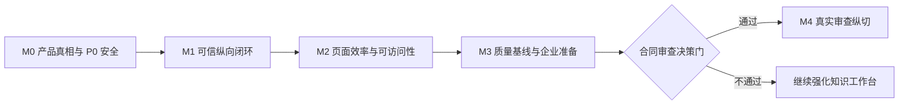

# 页面功能驱动的完整分析与后续迭代目标

> 日期：2026-07-19  
> 状态：迭代目标基线  
> 适用范围：当前 Vue 3 前端、FastAPI 业务 API、MinerU 解析链路、Elasticsearch 检索链路，以及 `frontend/review/stitch_` 静态审查原型  
> 评估方法：代码与历史提交审查、真实运行页面核验、真实只读 API 核验、双代理独立 UX/确定性检测、现有测试基线  
> 默认产品假设：当前只按“本机单用户”模式评估；M0 必须明确选择继续单机，还是升级为小团队。下一阶段先建立可信的“上传、预览、问答、溯源、留存”闭环；合同审查能力必须通过产品决策门后再进入主线。

## 1. 结论先行

当前真正可辨识的产品不是完整的“合同审查平台”，而是一个处于原型后期的**保险/法规知识库问答工具**：具备文档上传、解析、混合检索、流式问答、历史和收藏等基础能力，但多个页面承诺的任务与底层数据契约不一致，尚不具备可信发布条件。

本轮建议不直接把 `DocReview AI` 静态原型接入主导航。推荐采用以下顺序：

1. **先修复可信底座**：数据一致性、HTML 安全、删除/重析事务、聊天错误协议、持久化单一来源。
2. **再打通一个可验收纵向闭环**：固定文档上传后能预览，能限定该文档提问，答案带可点击证据，历史能可靠保存，删除后本地与索引都消失。
3. **随后解决规模化使用问题**：移动端、无障碍、分页、多文件队列、任务恢复、可观测性和评测集。
4. **最后进入合同审查决策门**：只有模板、规则、风险、审批、审计等真实数据契约成立后，才产品化四步审查流程。

建议的北极星任务是：

> 用户能在 3 分钟内，从自己管理的文档库获得一条带可定位原文证据的回答，并能回到原文完成核验；系统失败时不丢数据、不伪装成功、不泄露内部异常。

### 当前发布判断

| 维度 | 判断 | 主要依据 |
| --- | --- | --- |
| 核心功能 | 不可发布 | 文档列表显示“已入库”，两条记录的详情和预览均返回 404 |
| 数据可信 | 不可发布 | 列表索引与上传目录漂移；删除/重析可能留下孤儿索引或丢失旧版本 |
| 安全 | 不可发布 | Markdown/HTML 未消毒；外部请求存在关闭 TLS 校验；若选团队模式则还缺认证/资源归属 |
| 问答契约 | 不可发布 | 前端发送历史但后端未使用；错误可作为普通答案保存并继续发送完成事件 |
| 桌面体验 | 可用于内部验证 | 主要页面可导航，基础加载、筛选、确认和空态已存在 |
| 移动体验 | 阻断 | 390px 视口下页面宽 375px、实际滚动宽 584px；知识库表格宽 1120px |
| 测试 | 局部可靠 | 53 个后端单测全部通过，但只覆盖表格链路；无前端、API、端到端和安全测试 |

## 2. 产品现实与方向选择

### 2.1 当前已落地的产品

当前路由只有 6 个页面：智能问答、知识库、文档预览、历史、收藏和会话详情，见 `frontend/src/router/index.ts:5`。全局品牌仍为“保险智答”，见 `frontend/src/App.vue:20`。README 的主要能力也集中在文档入库、混合检索、问答、历史和收藏。

现有用户任务可以归纳为三类：

- **保险/法规知识工作者**：提问、比较、总结、查看原表和原文证据。
- **知识库运营人员**：上传、跟踪解析、预览、重析和删除文档。
- **本地部署维护人员**：配置 ES、Embedding、LLM、MinerU，判断依赖是否健康。

### 2.2 尚未落地的产品

`docs/superpowers/specs/2026-07-19-review-prototype-integration-design.md` 规划了上传、范本、规则和审查四步流程，但明确要求只使用本地演示数据，不调用现有文档和问答 API，见该文件第 33、46 行。当前代码中没有 `/review/*` 路由、review store 或审查业务 API。

静态原型展示了以下尚不存在的能力：

| 原型承诺 | 当前真实能力 | 缺口判断 |
| --- | --- | --- |
| 批次、云端导入、额度 | 只有本地 PDF/DOCX 上传 | 批次模型、云存储、计量和配额均缺失 |
| OCR 开关 | 仅定义 `needs_ocr` 状态，流水线不会产生 | OCR 策略和用户控制缺失 |
| 范本库、匹配度、自定义范本 | 无模板实体或 API | 需要模板版本、所有权和匹配算法 |
| 条款规则、阈值、模型选择 | 无规则实体或审查引擎 | 需要规则 DSL、版本、执行结果和可解释证据 |
| 风险卡片、文中高亮 | 只有问答文本与文档预览 | 需要风险位置、严重度、规则和原文映射 |
| 批准、拒绝、导出 | 无审批或报告实体 | 需要状态机、权限、审计和导出契约 |
| 账号、团队、审计日志 | 当前 API 无认证和租户 | 企业化前置能力完全缺失 |

### 2.3 三种迭代路线

| 路线 | 做法 | 收益 | 代价/风险 | 结论 |
| --- | --- | --- | --- | --- |
| A. 可信知识工作台 | 稳定现有上传、预览、问答、证据和记录闭环 | 最贴近已有代码；最快形成真实用户价值 | 不能立即展示完整审查故事 | **当前推荐** |
| B. 真实合同审查纵切 | 选择一个合同类型、一个范本、10-20 条规则，做真实风险与审批 | 产品定位更强，能验证法务价值 | 需要大量新后端、标注集、权限和审计 | A 完成后的决策门 |
| C. 先接静态审查演示 | 将 Stitch 页面和本地假数据接入主应用 | 演示速度快 | 两套上传入口、真假 AI 状态、品牌和数据割裂；误导用户 | 不进入主线；如保留只放 `/demo/review/*` |

**推荐路线：A → 审查决策门 → B。拒绝把 C 当成正式功能。**

## 3. 页面功能地图

| 页面/路由 | 用户任务 | 当前能力 | 现场/代码断点 | 目标状态 |
| --- | --- | --- | --- | --- |
| 应用壳层 | 识别位置、切换工作区 | 5 项顶部导航、激活态 | 移动端横向溢出；“详情管理”要求记忆 ID；emoji 图标混用 | 收敛为“问答、知识库、记录”三个工作区；详情作为上下文钻取 |
| `/` 智能问答 | 提问、停止、继续追问、查看证据 | 推荐问题、SSE 流式、停止、新建对话 | 后端忽略 `history`；错误文本可被当答案；来源不可定位；保存失败仍清空 | 文档范围、结构化引用、多轮上下文、重试/取消、可靠草稿与保存 |
| `/docs` 知识库 | 上传、筛选、跟踪、预览、重析、删除 | 扩展名校验、进度、状态、轮询、确认 | 当前两条 ready 记录预览均 404；标题均为 `original`；多文件共用进度；固定前 100 条 | 逐文件队列、分页、状态可恢复、数据自愈、可验证删除 |
| `/docs/:id` 文档预览 | 核验正文、大纲、表格、元数据 | 处理/失败/就绪分支、正文/表格/详情 tab | 运行时不可达；大纲目标 ID 未写入正文；HTML 无消毒；“去问答”不携带文档上下文 | 安全渲染、可用大纲、页码/版本、限定文档提问、来源深链 |
| `/history` 历史 | 搜索、复用、收藏、批量管理 | ID/问题/日期筛选、批量收藏/删除 | 历史中直接显示 ES `ConnectionError`；固定前 200 条；危险操作常驻 | 完整/失败状态分离、重试、分页、来源摘要、批量操作按选择显现 |
| `/favorites` 收藏 | 维护高价值答案 | 列表、批量取消、详情跳转 | 空态只有“暂无数据”；无行级取消；与历史复制存储 | 与记录页合并为 tab；教学型空态；单条/批量操作一致 |
| `/detail/:id?` 会话详情 | 查看一次会话并管理 | 手输 ID、查看、收藏、删除 | 顶层入口不符合用户心智；删除无确认；原始异常完整暴露 | 只从历史/收藏进入；支持证据定位、重试、删除确认；移出主导航 |
| `/review/*` 规划页 | 上传批次、选范本、配规则、审查 | 只有静态 HTML/PNG 与设计文档 | 无路由、数据、API、权限、审计或真实分析 | 通过审查决策门后做真实纵切，不以假数据冒充上线能力 |

## 4. 核心旅程诊断

### 4.1 当前主旅程


当前实际断点：

1. **上传 → 索引**：上传文件以 `original.ext` 推导 title，所有上传文档标题变成 `original`，损害 `title^3` 检索权重，见 `backend/api/routes/docs.py:70` 和 `backend/services/document_store.py:176`。
2. **索引 → 列表**：`.data/docs_index.json` 有 2 条 ready 记录，但 `.data/uploads` 有 0 个文档目录；列表不是可用文档的可靠视图。
3. **列表 → 预览**：现场点击第一条“预览”得到“文档不存在”；两条 preview API 都返回 404。
4. **预览 → 问答**：“去智能问答”只切换路由，没有传入 `doc_id` 或检索范围，见 `frontend/src/views/DocPreviewView.vue:134`。
5. **问题 → 回答**：请求 schema 和前端都发送历史，但 `backend/api/routes/chat.py` 只调用 `stream_answer(text)`，多轮上下文未使用，见 `backend/api/routes/chat.py:57`。
6. **回答 → 证据**：表格附录已有能力，但普通来源仍缺少统一的文件、章节、页码、原文摘录和可点击定位契约。
7. **回答 → 留存**：新建对话时保存失败被吞掉后仍清空；历史/收藏写入位置存在根目录与 `backend/.chat_data` 分裂，见 `frontend/src/stores/chat.ts:109`、`backend/services/chat_manager.py:15`。

### 4.2 现场运行证据

核验地址：`http://127.0.0.1:5173/`，业务 API：`http://127.0.0.1:8002/api`。

- 首页能看到 4 个推荐问题、输入框和新建对话；桌面布局可操作，但核心内容区大面积空白，首屏没有知识库范围、系统可用性或证据说明。
- 知识库显示 2 份文档，均为“已入库”；任一文档详情/preview API 实际为 404。
- `.data/uploads` 存在但没有文档目录，证明列表索引和真实文档已经漂移。
- 历史页将 `ConnectionError(... localhost:9200 ... WinError 10061)` 直接作为回答摘要和详情展示；内部依赖信息被存入用户记录。
- 收藏页为 0 条时只显示默认空表格和“暂无数据”，没有返回问答或收藏方法的下一步。
- 详情页顶层入口要求手输完整 ID；已加载的错误会完整展示基础设施异常。
- `/api/health/index` 当前返回 `exists=true,count=2`，说明“索引健康”与“文档可预览”不是同一个健康定义。

### 4.3 移动端现场证据

在 390×844 视口覆盖下：

- `documentElement.clientWidth=375`，`scrollWidth=584`，页面级横向溢出 209px。
- 顶部品牌文字被逐字挤成竖列，五个导航项超出屏幕；没有折叠菜单或底部导航。
- 首页聊天输入被压成极窄区域，推荐问题纵向堆叠在横向溢出的画布中。
- 知识库表格 `clientWidth=1120`，页面出现水平和垂直双滚动；多列被隐藏后只剩文件名和操作，仍无法形成稳定的移动任务。
- 发送/停止按钮为约 32px 圆按钮，低于建议的 44×44px 触控目标。

结论：当前移动端不是“待优化”，而是**核心任务不可完成**。如果短期只支持桌面，需要在产品约束中明确；如果移动端属于发布范围，该问题至少为 P1 发布阻断。

## 5. 体验健康度

Method: dual-agent (A: `/root/critique_assessment_a` · B: `/root/docs_product_history`)；两名独立评估代理的浏览器均不可用，实际页面证据由主评估上下文使用 in-app Browser 补齐。

### 5.1 Nielsen 启发式评分

| # | 启发式 | 分数 | 关键问题 |
| --- | --- | ---: | --- |
| 1 | 系统状态可见性 | 2/4 | 有进度和 loading，但“已入库”文档实际不存在，状态会误导 |
| 2 | 与现实世界匹配 | 2/4 | 中文领域词基本清楚，但暴露 ID、chunk、路由、CPU、重析等实现术语 |
| 3 | 用户控制与自由 | 2/4 | 有停止和部分确认；详情删除无确认，保存失败仍清空 |
| 4 | 一致性与标准 | 2/4 | Element Plus 基本统一，但图标语法、删除保护和空态不一致 |
| 5 | 错误预防 | 1/4 | 格式校验存在，但数据漂移、非事务重析和保存丢失缺少保护 |
| 6 | 识别优于回忆 | 2/4 | 主导航清楚；详情页要求记住完整 ID，证据需跨页回忆 |
| 7 | 灵活与高效 | 1/4 | 有 Enter 和少量批量操作；无真实分页、快捷路径和移动替代视图 |
| 8 | 审美与极简 | 2/4 | 克制但默认组件感强，首页空、管理页控件密、层级弱 |
| 9 | 错误识别与恢复 | 1/4 | 原始异常直接展示，多数失败只有瞬时 toast，缺少重试和保留上下文 |
| 10 | 帮助与文档 | 1/4 | 有少量上传提示，无术语解释、任务帮助和上下文指导 |
| **总分** |  | **16/40** | **Poor：存在任务阻断和信任问题** |

### 5.2 确定性设计检测

`impeccable detect` 仅发现 1 条 `side-tab`：`frontend/src/styles/main.css:171` 的 `blockquote` 左边框。该样式用于 Markdown 引用语义，不是卡片装饰侧条，判定为高概率假阳性。

这意味着当前首要问题不是渐变、玻璃拟态或卡片装饰等自动化反模式，而是**功能可信度、响应式、错误恢复和信息架构**。

### 5.3 认知负荷

8 项检查中 7 项失败，属于高负荷：

- 历史页同时暴露筛选、刷新、收藏、清空、删除和表格，缺少单一焦点。
- 历史、收藏和详情没有明确页面标题，视觉层级不足。
- 未选择记录时危险批量操作仍常驻，没有渐进披露。
- 顶部 5 项导航加详情 ID 输入，让用户建立不必要的产品心智地图。
- 用户需要从历史记住 ID，再到详情页输入；需要从回答记住来源，再去知识库寻找原文。
- “chunk”“路由”“CPU”“重析”提高了非技术用户的翻译成本。

### 5.4 正向基础

- 文档上传已具备格式校验、百分比、处理阶段、自动刷新、失败状态和重析入口。
- 聊天已有推荐问题、Enter 发送、流式反馈、自动滚动和停止生成。
- 视觉总体克制，使用单字体、有限色彩和 `prefers-reduced-motion`，没有严重装饰性反模式。
- 表格高保真链路已有 53 个快速单测，当前全部通过。
- 路由按页懒加载，前端 `vue-tsc --noEmit` 当前通过。

## 6. 优先级目标

### P0：可信与安全底座

#### P0-1 安全渲染、传输与部署边界

**问题**：模型输出、历史答案、预览 Markdown 和表格 HTML 直接进入 `v-html`，未见消毒库；外部 provider 请求存在关闭 TLS 证书校验和抑制证书告警的实现；接口无认证、用户/租户或资源归属。

**目标**：

- 建立唯一的 Markdown/HTML 安全渲染组件，采用严格 allowlist 消毒。
- 禁止事件属性、`javascript:` URL、脚本、iframe 和危险 SVG。
- 所有 ES、Embedding、LLM 和 MinerU HTTP 客户端默认验证 TLS；支持配置受信 CA；证书错误必须 fail closed，不得用 `verify=False` 或全局关闭告警绕过。
- M0 对部署模式做硬决策：单机模式强制 loopback 并明确拒绝反向代理暴露；团队模式把认证、资源归属、授权和写操作审计提升为 P0。

**验收**：`script`、`img onerror`、危险链接和恶意表格均不能执行；错误证书被拒绝且可通过受信 CA 正常连接；0 条原始密钥或内部堆栈进入前端。单机模式验收所有业务端口仅绑定 loopback 且不支持代理暴露；团队模式另验收未授权用户不能读取、问答或删除他人资源，且写操作全部有审计。

#### P0-2 文档生命周期单一事实源

**问题**：列表索引可以显示不存在的文档；上传 title 固定为 `original`；删除 ES 失败会被吞掉；重析先删旧索引再执行新流水线。

**目标**：

- 使用 SQLite/事务数据库保存文档、版本和任务状态；`.data/docs_index.json` 不再作为事实源。
- 文档状态绑定版本和任务代际；新版本全部完成后才切换 active version。
- 使用最小可持久化任务队列；进程重启后恢复 queued/processing 任务，任务具有幂等键，delete/reparse 互斥。
- 删除只有在本地文件、元数据和 ES chunk 都成功或进入可重试补偿状态后才返回成功。
- 启动时执行一致性扫描：孤儿列表、孤儿目录、孤儿索引进入可见修复队列。
- title 从原始文件名生成，并迁移已有 meta 和 ES 文档。

**验收**：固定夹具上传后列表、详情、预览、ES title 一致；连续 20 次 upload→preview 均成功；解析中重启进程后任务可恢复且最终只提交一次；任一阶段注入失败时旧版本仍可用；删除完成后该 `doc_id` 的本地文件和 ES 命中均为 0。

#### P0-3 真实聊天与错误状态机

**问题**：多轮 history 未进入回答；provider 异常被包装成普通答案，并可能继续发送 `done`；保存失败静默丢失会话。

**目标**：

- SSE 终态严格为 `done | error | cancelled` 三选一。
- 真正传入受限、可审计的多轮上下文；长会话有截断/摘要策略。
- 错误事件包含稳定错误码、用户可读说明、是否可重试和支持定位 ID，不含内部连接字符串。
- 会话草稿在切页/刷新后可恢复；只有保存成功后才清空。
- README、UI 与实现保持一致：Tavily 未启用时不得显示或记录“网络搜索成功”。

**验收**：代词追问能引用上一轮；错误路径不再发送 `done`；中断后显示“回答不完整”并可重试；保存失败保留全部消息；历史中不出现 Python/ES/HTTP 堆栈。

#### P0-4 确定性基础可靠性测试

**问题**：现有 53 个测试全部集中在表格；验证脚本未进入 CI，且缺少隔离和清理。

**目标**：建立无外部真实依赖的 fake ES/Embedding/LLM/MinerU 集成栈，先固定执行 P0 基础链路：

`上传夹具 → 处理完成 → 列表可见 → 预览可用 → 聊天唯一终态 → 历史可靠保存 → 删除 → 索引为零`

**验收**：CI 连续 20/20 通过、无残留；进程重启和每个外部依赖失败点都有恢复/回滚/补偿断言；前端至少覆盖基础主旅程、错误和 XSS。限定文档问答与引用定位的完整闭环测试在 P1-1 能力完成后加入 M1 退出门。

### P1：页面任务闭环与规模化使用

#### P1-1 问答与原文证据闭环

- 问答支持“全部知识库”与“当前文档”范围。
- 每条关键结论至少关联一个结构化引用：文件、版本、章节、适合文件格式的定位器、原文摘录、chunk ID。
- 引用可直接打开预览并定位目标 block；内部 chunk 术语不直接展示给普通用户。
- 预览大纲必须对应真实 DOM 锚点；“去智能问答”携带 `doc_id` 和版本。
- 增加完整 M1 纵向测试：限定文档提问、结构化引用、原文定位、历史、收藏和删除全部闭环。

#### P1-2 响应式与无障碍

- 390px 下改为抽屉或底部导航；页面禁止 body 级横向滚动。
- 管理表格在移动端转换为优先字段列表/详情抽屉，不要求在 1120px 表格上横向找操作。
- 所有触控目标至少 44×44px；图标按钮有 `aria-label` 和 tooltip。
- 消息区使用 `role=log`/`aria-live`；键盘可完成发送、停止、导航、筛选和确认。
- `--muted:#94a3b8` 在白底仅 2.56:1，需要提升到 WCAG AA 4.5:1。

#### P1-3 知识库运营效率

- 多文件上传变成逐文件队列，分别显示进度、状态、错误和重试。
- 列表使用真实服务端分页，显示当前范围和总数；支持 `processing` 聚合筛选。
- 轮询请求去重，任务完成后停止；慢请求不会乱序覆盖新状态。
- 提供依赖状态和任务队列入口，但不把内部堆栈暴露给普通用户。
- 删除、重析、批量操作遵循统一确认和撤销/补偿规则。

#### P1-4 记录信息架构

- 将历史与收藏整合为“记录”工作区的两个 tab。
- 会话详情只作为记录的上下文钻取，移除顶层“详情管理”。
- 区分完成、回答不完整、失败、已取消；失败记录提供重试并保留原问题。
- 收藏支持行级切换和批量操作；空态明确引导回问答页。

#### P1-5 高级可观测性与并发治理

- 在 P0 最小持久队列之上增加容量控制、背压、重试策略、死信和管理视图。
- 每次请求/任务带 `request_id/doc_id/version/task_id`，记录阶段耗时、队列深度和依赖错误率。
- MinerU adapter 不在 async handler 内执行最长 3600 秒的同步阻塞请求。
- 复杂问答取消后 2 秒内释放 provider 连接和 worker。

### P2：产品效率与工程收敛

- 使用统一图标库替换 emoji/字符图标，统一按钮、表格、空态、错误和状态组件。
- 只按需加载 Element Plus，建立 bundle budget；当前没有性能回归门。
- 补路由 404、页面标题、文档标题同步和深链恢复。
- 合并离线 indexer 与上传流水线，使用确定性 chunk `_id`，避免重复执行产生重复数据。
- 在真实 OCR 能力完成前删除或隐藏 `needs_ocr` 承诺。
- 建立任务型帮助：首次上传、来源解释、失败恢复和数据出境说明。

## 7. 目标页面定义

### 7.1 应用壳层

**主导航**：问答、知识库、记录。系统状态、设置和帮助进入工具菜单；详情只由上下文打开。

**完成定义**：

- 桌面、平板、390×844 均无页面级横向滚动或文字遮挡。
- 当前工作区、文档范围和系统是否可用始终可识别。
- 未知路由显示可恢复的 404，不是空壳。

### 7.2 智能问答

**页面主任务**：选择知识范围，提出问题，获得可核验答案，继续追问或保存。

**必备状态**：空、加载示例失败、检索、生成、停止、完成、部分完成、可重试错误、无证据、会话保存失败。

**完成定义**：

- 发送前可看到当前范围；从预览进入时默认锁定文档版本。
- 回答正文与证据分区；每个引用可定位原文。
- 失败不会被当成答案，刷新不会丢草稿，多轮追问真实使用上下文。

### 7.3 知识库

**页面主任务**：把文件可靠变成可检索、可预览、可删除的知识资产。

**必备状态**：空、上传中、排队、解析、降级解析、索引、就绪、失败、可重试、删除补偿、数据漂移。

**完成定义**：

- 每个文件有独立进度和错误；列表、元数据、文件、IR、索引版本一致。
- 超过 100 条仍全部可达；刷新和筛选不制造竞态。
- 删除结果可验证；系统能识别并修复孤儿数据。

### 7.4 文档预览

**页面主任务**：核验系统理解的原文结构，并以该文档为上下文继续问答。

**完成定义**：

- 正文、表格和来源 HTML 安全；大纲、页码和表格定位有效。
- 处理中显示持续状态；失败保留原因和重试；404 区分“已删除”和“索引漂移”。
- “询问此文档”携带稳定的 `doc_id + version`。

### 7.5 记录

**页面主任务**：找回、验证、重试和收藏有价值的会话。

**完成定义**：

- 历史/收藏共享统一筛选、分页和详情。
- 错误与不完整回答不会伪装成正常摘要。
- 详情不要求用户记忆 ID；危险操作有统一确认。

## 8. 目标数据与 API 契约

### 8.1 文档状态

```text
queued -> parsing -> normalizing -> chunking -> indexing -> ready
   |          |            |            |            |
   +----------+------------+------------+----------> failed(retryable?)

ready(version N) --reparse--> staging(version N+1) --atomic switch--> ready(version N+1)
```

`ready` 必须同时满足：元数据存在、原始文件存在、IR/preview 可读、预期 ES chunk 写入成功且可按 `doc_id + version` 查询。

### 8.2 聊天 SSE

```text
meta -> status* -> token* -> done
meta -> status* -> error
meta -> status* -> token* -> cancelled
```

终态三选一；`error` 不能随后发送 `done`。建议错误字段：`code`、`message`、`retryable`、`support_id`，禁止直接透出 provider 或连接堆栈。

### 8.3 引用契约

每条引用至少包含稳定文档身份、版本、原文摘录和一个格式合法的定位器。PDF 使用页码定位；DOCX 没有稳定分页，使用章节、block 或段落锚点，页码字段可为空：

```json
{
  "doc_id": "stable-id",
  "document_version": 2,
  "filename": "工伤保险条例.docx",
  "title": "工伤保险条例",
  "chunk_id": "stable-chunk-id",
  "quote": "可供用户核验的原文摘录",
  "locator": {
    "type": "block",
    "section_path": ["第五章", "第三十五条"],
    "block_id": "block-42",
    "paragraph_index": 17,
    "page_start": null,
    "page_end": null
  }
}
```

### 8.4 审查风险契约（决策门后）

真实审查功能至少需要：文档版本、范本版本、规则版本、风险严重度、命中原文、位置、理由、建议、处理状态、处理人和审计事件。缺少任一版本信息，就无法复现或审计结果。

## 9. 分阶段路线图



### M0：产品真相与安全基线

- 对部署模式做硬决策并记录：继续本机单用户，或升级为小团队；不得保持模糊中间态。
- 决定并记录现阶段产品名、目标用户和数据出境说明。
- README 与 UI 删除未启用的 Tavily、OCR、合同审查等误导性承诺。
- 完成 HTML 消毒、provider TLS 验证、持久化统一、聊天错误终态和文档一致性修复方案。
- 静态审查原型若保留，只存在于明确标注的 demo 路径。

**退出条件**：所有 P0 有负责人、测试和回滚；当前两条孤儿文档完成迁移或清理；无已知可执行 XSS；没有关闭 TLS 校验的生产路径；部署模式对应的网络/认证验收全部通过。

### M1：可信纵向闭环

- 固定 DOCX/PDF 夹具完成 upload→preview→doc-scoped QA→citation→history→favorite→delete。
- 文档 version、结构化 citation 和聊天终态进入正式 API schema。
- 页面针对各终态提供清晰恢复动作。
- 解析中重启进程后任务能恢复，并保证相同任务只提交一个活动版本。

**退出条件**：CI 连续 20/20 通过；删除后本地与索引均为零；答案引用可一键定位原文。

### M2：页面效率与可访问性

- 响应式壳层、移动列表、44px 触控、键盘路径、ARIA live 和 AA 对比度。
- 文档/历史/收藏真实分页，多文件逐项上传，记录 IA 收敛。
- 统一页面标题、空态、错误、确认和图标系统。

**退出条件**：390×844、768×1024、1440×900 三个视口无阻断；主旅程键盘可完成；自动 A11y 无严重项。

### M3：质量基线与企业准备

- 建立代表性文档、表格、问答和失败评测集。
- 在 P0 持久队列之上引入背压、死信、结构化日志、指标、trace 和依赖健康。
- 如果 M0 选择团队模式，在试点前完成认证、租户隔离、权限、审计和数据出境治理。

**退出条件**：达到第 10.1-10.3 节指标；0 个高危安全问题；每个回答和任务可追踪。第 10.4 节只用于 M4/合同审查试点，不作为进入决策门的前置结果。

### 合同审查决策门

必须同时满足：

1. 明确选择一个合同类型和实际业务团队。
2. 有 30 份以上可授权使用的标注文档。
3. 有规则所有人、规则版本和更新流程。
4. 明确风险召回/精确率目标和人工兜底。
5. 账号、权限、审计和数据出境方案已确认。

### M4：真实审查纵切

只实现一个范本、10-20 条高价值规则、持久化风险、原文定位、处理状态和审计。先验证人机协作价值，再扩展模板库、批次、导出和模型参数；不一次性复制静态原型的所有页面承诺。

## 10. 指标与验收门槛

### 10.1 功能可靠性

| 指标 | 目标 |
| --- | ---: |
| 固定夹具 upload→preview 成功率 | 连续 20/20 |
| 列表 ready 与 preview 可达一致率 | 100% |
| 删除后本地文件和 ES chunk 清除率 | 100% |
| 会话保存失败时消息保留率 | 100% |
| SSE 唯一终态符合率 | 100% |
| 原始基础设施异常进入 UI 的数量 | 0 |
| XSS 安全用例拦截率 | 100% |

### 10.2 检索与答案质量

| 指标 | 首阶段目标 |
| --- | ---: |
| 代表性文档数 | ≥20 |
| 代表性表格数 | ≥30 |
| 文档解析成功率 | ≥98% |
| 关键数值单元格保真率 | 100% |
| Recall@5 | ≥90% |
| 有依据回答率 | ≥95% |
| 引用可定位且原文一致率 | ≥95% |
| 简单本地问答首 token P95 | ≤5 秒 |

### 10.3 页面质量

| 指标 | 目标 |
| --- | ---: |
| 390×844 页面级横向滚动 | 0 |
| 主流程最小触控目标 | ≥44×44px |
| 普通文本对比度 | ≥4.5:1 |
| 键盘主旅程完成率 | 100% |
| 自动 A11y 严重问题 | 0 |
| 100/200 条以上记录可达率 | 100% |

### 10.4 未来审查质量（M4/试点退出指标）

| 指标 | 试点目标 |
| --- | ---: |
| 标注文档 | ≥30 |
| 高风险召回率 | ≥90% |
| 高风险精确率 | ≥80% |
| 风险含规则版本和原文证据 | 100% |
| 人工审查时间下降 | ≥30% |

### 10.5 指标字典

所有退出指标必须绑定评测集版本、夹具哈希、测量脚本版本、运行环境和原始结果；没有这些元数据的百分比不作为阶段退出证据。

| 指标组 | 最小样本与分母 | 判定口径 | 环境/工具要求 |
| --- | --- | --- | --- |
| upload→preview 与删除 | 1 个固定 PDF + 1 个固定 DOCX，各执行 10 次，共 20 次独立运行 | 每次从干净数据命名空间开始；ready 后详情/preview/ES 均存在；删除后本地和 ES 均为零；任一残留计失败 | fake 依赖 CI；记录夹具 SHA-256 和数据库/索引快照 |
| 文档解析成功率 | 版本化评测集 ≥20 份文档、≥30 张表 | 成功=进入 ready 且正文可预览；降级、超时和人工重试均单独标注并计入分母 | 固定解析器版本、CPU/内存和超时；保存每份文档阶段耗时 |
| 关键数值单元格保真 | 评测集全部人工标注关键数值单元格 | 规范化空白后逐单元格精确匹配；漏行、错列、改写数字均失败 | 金标双人复核；测量脚本和金标版本入库 |
| Recall@5 | ≥100 个版本化问题，每题至少 1 个相关 chunk 金标 | Top 5 中出现任一相关 chunk 计成功；无金标问题不进入分母 | 固定索引版本、Embedding 模型和检索参数 |
| 有依据回答率 | 与 Recall 评测集同版，≥100 个问题 | 回答中的每个可核查主张都被引用原文支持才计成功；拒答按预先定义规则计分 | 两名评审独立标注，分歧由第三方裁决 |
| 引用可定位且一致 | ≥100 条生成引用 | 定位器能打开同一文档版本并显示包含 quote 的目标；PDF 用页码，DOCX 用 block/段落锚点 | 自动深链检查 + 人工抽样 20% |
| 首 token P95 | 同一简单本地问题集连续 ≥100 次 | 从请求发出到首 token；超时/错误按超时上限计入，不剔除；冷启动和热运行分开报告 | 固定硬件、并发、provider、网络区域和缓存状态 |
| 响应式/键盘/A11y | 390×844、768×1024、1440×900；第 7 节每页主任务 | body 横向滚动为零；任务全部键盘可完成；严重/关键自动问题为零 | 固定 Chromium 与 axe-core 版本，附截图、DOM 指标和人工键盘记录 |
| 记录规模可达 | 文档 201 条、历史 501 条、收藏 501 条 | 首条、跨页边界和末条都可通过分页/筛选到达；总数与可达数一致 | 隔离数据库夹具；自动分页与筛选测试 |
| 合同审查质量 | 决策门后 ≥30 份双人标注文档 | 召回/精确率按风险实例计算；人工时间用同一评审者、同一合同集做前后对照 | 冻结规则/范本/模型版本；保存混淆矩阵和计时原始数据 |

## 11. 迭代 Backlog

| ID | 优先级 | 页面/系统 | 目标 | 前置依赖 |
| --- | --- | --- | --- | --- |
| T01 | P0 | 全局 | 统一安全 Markdown/HTML 渲染；启用 TLS 校验和受信 CA | 无 |
| T02 | P0 | 产品/安全 | M0 部署模式决策；团队模式完成认证、资源归属和审计 | 无 |
| T03 | P0 | 文档 | 数据库事实源、版本化任务、最小持久队列、重启恢复、孤儿扫描 | 无 |
| T04 | P0 | 文档 | 原文件名 title、事务重析、可验证删除 | T03 |
| T05 | P0 | 问答 | 多轮上下文与唯一 SSE 终态 | 无 |
| T06 | P0 | 记录 | 统一 `.chat_data`、可靠草稿与保存 | T05 |
| T07 | P0 | 测试 | fake 依赖的 P0 基础可靠性 E2E | T01-T06 |
| T08 | P1 | 问答/预览 | 文档范围与格式合法的结构化引用深链 | T03、T05 |
| T09 | P1 | 测试 | M1 完整闭环 E2E | T07、T08 |
| T10 | P1 | 壳层 | 三工作区 IA 与响应式导航 | 无 |
| T11 | P1 | 知识库 | 逐文件队列、分页、轮询去重、状态修复 | T03 |
| T12 | P1 | 记录 | 历史/收藏合并、状态化摘要、上下文详情 | T06、T10 |
| T13 | P1 | 全局 | WCAG AA、键盘、ARIA、44px 触控 | T10 |
| T14 | P1 | 平台 | 背压/死信、日志、指标、trace、取消和高级并发治理 | T03、T05 |
| T15 | P2 | 工程 | 图标/状态组件、按需加载、bundle budget | T10 |
| T16 | Gate | 审查 | 产品、数据、规则、权限和评测决策 | M3 完成 |
| T17 | Gate 后 | 审查 | 单合同类型真实审查纵切 | T16 通过 |

## 12. 测试与交付证据

### 当前基线

- `backend`: `python -m unittest discover -s tests -v`，53/53 通过，耗时约 0.003 秒。
- `frontend`: `npm exec vue-tsc -- --noEmit` 通过。
- 前端 `frontend/package.json` 没有 `test`、`lint` 或正式 `typecheck` script。
- 现有后端测试只覆盖表格转换、伪表升格、表格上下文和答案附表；未覆盖 22 个业务路由、持久化、检索、LLM、MinerU、并发、取消、失败回滚和权限。

### 每个迭代必须提交的证据

- 需求 ID、代码提交、自动测试和人工验证一一对应。
- 端到端夹具固定，不从 `docs/` 随机取第一个文件。
- 测试创建的数据全部隔离并清理。
- 页面交付附桌面、平板、移动三组截图与溢出检查。
- 发布记录写明迁移、回滚、已知限制和真实外部依赖。
- 禁止出现“计划全部未勾选，但进度文档声称已完成”的状态漂移。

## 13. 非目标

当前阶段明确不做：

- 不把静态 `DocReview AI` 演示数据包装成真实 AI 审查结果。
- 不同时维护“知识库上传”和“审查上传”两套不互通入口。
- 不在核心可靠性完成前投入大规模换色、动画或品牌重构。
- 不在实现和验证前继续承诺 Tavily 网络补充、OCR 开关、配额、账号或审计。
- 不为追求功能数量一次性支持全部合同类型、全部模板和自定义规则。
- 不以单元测试通过替代真实 upload→preview→QA→delete 验收。

## 14. 风险与决策点

| 风险 | 影响 | 处理 |
| --- | --- | --- |
| 现有列表、文件和 ES 已漂移 | 迁移时可能丢失或误删 | 先做只读扫描和备份，再按 doc_id/version 修复 |
| 根目录与 backend 下历史分裂 | 用户记录不可见或重复 | 设计一次性迁移并校验条数/哈希 |
| 外部 Embedding/LLM 数据出境 | 企业试点合规风险 | 明示 provider、加密/TLS、脱敏、可选本地模型 |
| 静态审查原型影响优先级 | 团队误判为低成本前端工作 | 用能力矩阵和决策门管理，不按截图拆任务 |
| 依赖真实外部服务的 E2E 不稳定 | CI 假阴性/假阳性 | fake 契约测试为主，受控真实环境验证为辅 |
| 当前工作区已有未提交启动脚本改动 | 文档变更被混入无关修改 | 本文档只新增目标文件，不修改或回退现有改动 |

## 15. 关键证据索引

- 路由与当前页面：`frontend/src/router/index.ts:5`
- 顶部导航与品牌：`frontend/src/App.vue:20`
- 全局固定头部和颜色：`frontend/src/styles/main.css:1`
- 问答保存失败仍清空：`frontend/src/stores/chat.ts:109`
- 文档列表固定前 100 条：`frontend/src/views/DocsListView.vue:29`
- 多文件共享上传状态：`frontend/src/views/DocsListView.vue:89`
- 预览大纲滚动和未消毒渲染：`frontend/src/views/DocPreviewView.vue:38`、`:96`、`:216`
- 后端忽略聊天历史：`backend/api/routes/chat.py:57`
- README 承诺与 Tavily 硬禁用：`backend/services/search.py:305`
- 上传 title 使用 `original.ext`：`backend/api/routes/docs.py:70`
- 文档 JSON 事实源和非原子写入：`backend/services/document_store.py:52`
- 先删旧索引的重析：`backend/api/routes/docs.py:173`
- 删除索引异常被吞：`backend/services/document_pipeline.py:849`
- 会话持久化路径：`backend/services/chat_manager.py:15`
- 审查原型被定义为本地演示：`docs/superpowers/specs/2026-07-19-review-prototype-integration-design.md:46`
- 前端缺少测试脚本：`frontend/package.json:6`

## 16. 文档自检

- [x] 以真实页面任务而不是技术模块作为主线。
- [x] 区分已实现、部分实现、运行时阻断和静态原型。
- [x] 给出三种路线、明确推荐和不推荐项。
- [x] P0/P1/P2 均有目标、依赖和可量化验收。
- [x] 迭代顺序满足“可信底座 → 纵向闭环 → 规模化 → 审查决策门”。
- [x] 无未决占位符或依赖隐含产品决定的模糊要求。
